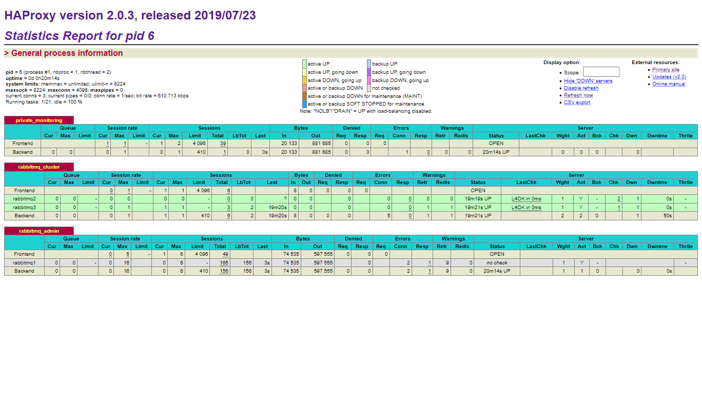
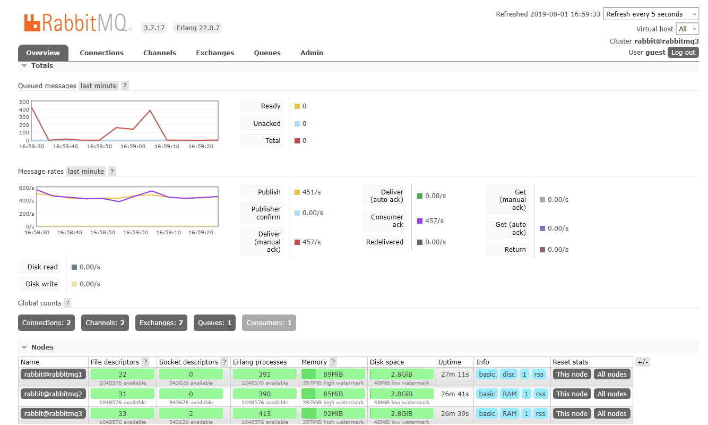

# rabbitmq-ha-demo
A project for demostrating a rabbitmq cluster.

## Topology

RabbitMQ servers are called RM1, RM2, RM3.
Proxy server are called HAPROXY.
Producer are called P.
Consumer are called C.

```
+-----+     +-----+     +-----+
| RM1 |-----| RM2 |--+--| RM3 |
+-----+     +-----+  |  +-----+
   |                 |
+-----------------------------+
|           HAPROXY           |
+-----------------------------+
   |                       |
+-----+                 +-----+
|  P  |                 |  C  |
+-----+                 +-----+

```

Proxy are configured as below.
```
listen private_monitoring
    bind    0.0.0.0:8100
    mode    http
    stats   refresh  5s
    stats   uri  /stats
    stats   realm   Haproxy
    stats   auth  admin:admin

listen rabbitmq_cluster
    bind    0.0.0.0:5672
    mode    tcp
    option  tcplog
    balance roundrobin
    server  rabbitmq1  172.24.0.10:5672  check  inter  5000  rise  2  fall  3
    server  rabbitmq2  172.24.0.11:5672  check  inter  5000  rise  2  fall  3
    server  rabbitmq3  172.24.0.12:5672  check  inter  5000  rise  2  fall  3

listen rabbitmq_admin
    bind    0.0.0.0:15672
    mode    http
    server  rabbitmq1 172.24.0.10:15672
```

## Setup

1. Run following commands to start this lab.
```bash
docker-compose up
```

2. Waiting for RabbitMQ to be started.
```
haproxy_1    | [WARNING] 212/075550 (6) : Server rabbitmq_cluster/rabbitmq3 is UP
```

3. Run following commands to enable queue mirroring (in another terminal session)
```bash
docker-compose exec rabbitmq1 bash
# rabbitmq1> rabbitmqctl set_policy ha-all "^" '{"ha-mode":"nodes", "ha-params":["rabbit@rabbitmq2", "rabbit@rabbitmq3"]}'
rabbitmq1> rabbitmqctl set_policy ha-all "^" '{"ha-mode":"all"}'
rabbitmq1> exit
```

4. Open following urls, all stats should be green:
```
HAProxy Stats: http://localhost:8100/stats
RabbitMQ Management: http://localhost:15672/#/
```





## Test
1. Run following command to scale-out consumer.
```bash
docker-compose scale consumer=4
```

2. Run following command to stop rabbitmq2 (in another terminal session)
```bash
docker-compose stop rabbitmq2
```

```bash
consumer_3   | [2019-08-01 09:27:45.895][io_services_utils.py:907][INFO]_AsyncTransportBase._initate_abort(): Initiating abrupt asynchronous transport shutdown: state=1; error=Conne
ctionResetError(104, 'Connection reset by peer'); <socket.socket fd=6, family=AddressFamily.AF_INET, type=SocketKind.SOCK_STREAM, proto=6, laddr=('172.24.0.6', 47772)>
consumer_3   | [2019-08-01 09:27:45.895][io_services_utils.py:870][INFO]Deactivating transport: state=1; <socket.socket fd=6, family=AddressFamily.AF_INET, type=SocketKind.SOCK_STRE
AM, proto=6, laddr=('172.24.0.6', 47772)>
consumer_3   | [2019-08-01 09:27:45.895][base_connection.py:429][ERROR]connection_lost: StreamLostError: ("Stream connection lost: ConnectionResetError(104, 'Connection reset by pee
r')",)
consumer_3   | [2019-08-01 09:27:45.896][connection.py:1999][INFO]AMQP stack terminated, failed to connect, or aborted: opened=True, error-arg=StreamLostError: ("Stream connection l
ost: ConnectionResetError(104, 'Connection reset by peer')",); pending-error=None
consumer_3   | [2019-08-01 09:27:45.896][connection.py:2065][INFO]Stack terminated due to StreamLostError: ("Stream connection lost: ConnectionResetError(104, 'Connection reset by p
eer')",)
consumer_3   | [2019-08-01 09:27:45.896][io_services_utils.py:883][INFO]Closing transport socket and unlinking: state=2; <socket.socket fd=6, family=AddressFamily.AF_INET, type=Sock
etKind.SOCK_STREAM, proto=6, laddr=('172.24.0.6', 47772)>
consumer_3   | [2019-08-01 09:27:45.898][blocking_connection.py:521][ERROR]Unexpected connection close detected: StreamLostError: ("Stream connection lost: ConnectionResetError(104,
 'Connection reset by peer')",)
rabbitmq1_1  | 2019-08-01 09:27:45.929 [info] <0.411.0> rabbit on node rabbit@rabbitmq2 down
consumer_3   | [2019-08-01 09:27:45.899][api.py:40][WARNING]Stream connection lost: ConnectionResetError(104, 'Connection reset by peer'), retrying in 10 seconds...
rabbitmq1_1  | 2019-08-01 09:27:46.048 [info] <0.411.0> Node rabbit@rabbitmq2 is down, deleting its listeners
rabbitmq1_1  | 2019-08-01 09:27:46.066 [info] <0.411.0> node rabbit@rabbitmq2 down: connection_closed
rabbitmq3_1  | 2019-08-01 09:27:46.082 [info] <0.365.0> Node rabbit@rabbitmq2 is down, deleting its listeners
rabbitmq3_1  | 2019-08-01 09:27:46.093 [info] <0.365.0> node rabbit@rabbitmq2 down: connection_closed
rabbitmq1_1  | 2019-08-01 09:27:46.123 [info] <0.1201.0> Mirrored queue 'test' in vhost '/': Master <rabbit@rabbitmq1.1.974.0> saw deaths of mirrors <rabbit@rabbitmq2.3.663.0>
producer_1   | [2019-08-01 09:27:46.463][producer.py:57][INFO]Sent 68000 messages.
rabbitmq-ha-demo_rabbitmq2_1 exited with code 137
producer_1   | [2019-08-01 09:27:48.150][producer.py:57][INFO]Sent 68500 messages.
producer_1   | [2019-08-01 09:27:49.467][producer.py:57][INFO]Sent 69000 messages.
producer_1   | [2019-08-01 09:27:50.486][producer.py:57][INFO]Sent 69500 messages.
producer_1   | [2019-08-01 09:27:51.606][producer.py:57][INFO]Sent 70000 messages.
producer_1   | [2019-08-01 09:27:52.819][producer.py:57][INFO]Sent 70500 messages.
producer_1   | [2019-08-01 09:27:54.347][producer.py:57][INFO]Sent 71000 messages.
```

3. Run following command to start rabbitmq2
```bash
docker-compose start rabbitmq2
```

```bash
haproxy_1    | [WARNING] 212/094435 (6) : Server rabbitmq_cluster/rabbitmq2 is UP, reason: Layer4 check passed, check duration: 0ms. 3 active and 0 backup servers online. 0 sessions requeued, 0 total in queue.
producer_1   | [2019-08-01 09:45:45.431][producer.py:57][INFO]Sent 192500 messages.
rabbitmq1_1  | 2019-08-01 09:45:45.506 [info] <0.690.0> Mirrored queue 'test' in vhost '/': Synchronising: 28206 messages to synchronise
rabbitmq1_1  | 2019-08-01 09:45:45.509 [info] <0.690.0> Mirrored queue 'test' in vhost '/': Synchronising: batch size: 4096
rabbitmq1_1  | 2019-08-01 09:45:45.525 [info] <0.2605.0> Mirrored queue 'test' in vhost '/': Synchronising: mirrors [rabbit@rabbitmq2] to sync
rabbitmq1_1  | 2019-08-01 09:45:46.027 [info] <0.690.0> Mirrored queue 'test' in vhost '/': Synchronising: complete
producer_1   | [2019-08-01 09:45:46.794][producer.py:57][INFO]Sent 193000 messages.
```

## Cleanup

Run following command to stop and remove all containers.
```bash
docker-compose down
```

## Note

Please feel free to extend the test steps.

## References
[pardahlman/docker-rabbitmq-cluster](https://github.com/pardahlman/docker-rabbitmq-cluster)